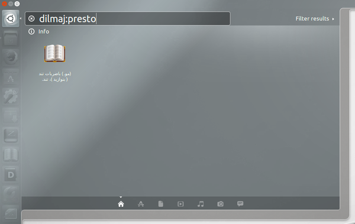
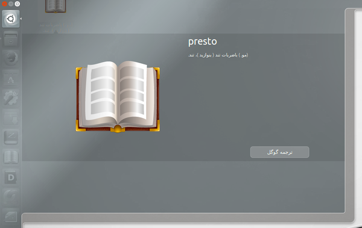

# Unity-Dilmaj 0.6
Unity-Dilmaj is a small and fast English-to-Persian dictionary for Unity Dash.

# How to create deb file
```
git clone https://github.com/AhmadHamzeei/unity-dilmaj.git
cd unity-dilmaj
sudo ./make_deb.sh
```

# Screenshot



